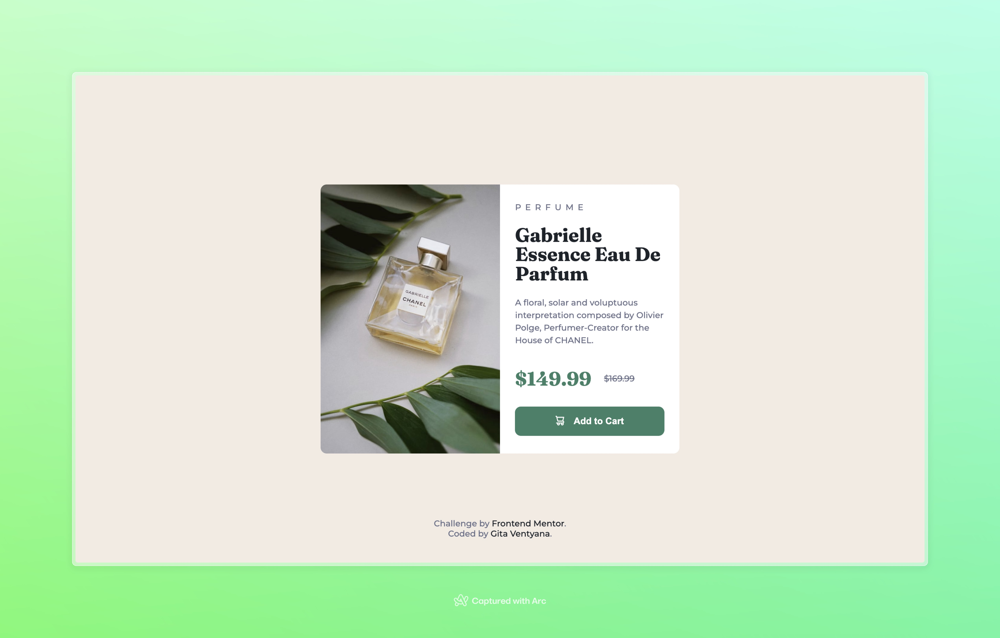

# Frontend Mentor - Product preview card component solution

This is a solution to the [Product preview card component challenge on Frontend Mentor](https://www.frontendmentor.io/challenges/product-preview-card-component-GO7UmttRfa). Frontend Mentor challenges help you improve your coding skills by building realistic projects.

## Table of contents

- [Overview](#overview)
  - [The challenge](#the-challenge)
  - [Screenshot](#screenshot)
  - [Links](#links)
- [My process](#my-process)
  - [Built with](#built-with)
  - [What I learned](#what-i-learned)
  - [Useful resources](#useful-resources)
- [Author](#author)

## Overview

### The challenge

Users should be able to:

- View the optimal layout depending on their device's screen size
- See hover and focus states for interactive elements

### Screenshot

### Links

- Solution URL: [Link](https://github.com/appsbygita/fm-prod-prev-card)
- Live Site URL: [Link](https://gita-prod-prev-card.vercel.app/)

## My process

### Built with

- Semantic HTML5 markup
- CSS custom properties
- Flexbox
- Mobile-first workflow

### What I learned

- Using the `picture` tag to serve different image source for different display sizes.
- Tried to do a mobile-first approach for this one. Still need more practice.

### Useful resources

- [MDN Web Docs](https://developer.mozilla.org/en-US/docs/Web/HTML/Element/picture)

## Author

- Frontend Mentor, Gita Ventyana - [@appsbygita](https://www.frontendmentor.io/profile/appsbygita)
